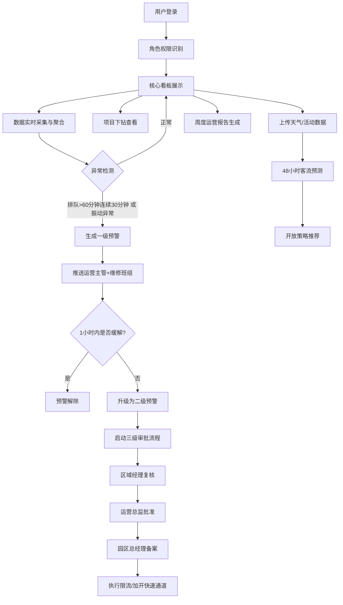

## 1. 产品概述

主题公园游客体验与设备运营智能分析平台，为大型主题公园提供实时运营监控、预警管理、客流预测与优化决策的一体化智能平台。
- 面向园区总经理、运营总监、区域经理、运营主管、维修班组等多角色用户，解决运营数据分散、预警滞后、决策依赖经验的痛点
- 整合排队时长、闸机进出、餐饮销售、设备振动、员工排班等多源数据，通过数据驱动实现精细化运营和游客体验提升

## 2. 核心功能

### 2.1 用户角色
| 角色 | 注册方式 | 核心权限 |
|------|----------|----------|
| 园区总经理 | 系统分配 | 全园区数据查看、二级预警备案、运营报告审批 |
| 运营总监 | 系统分配 | 全园区数据查看、二级预警批准、策略发布 |
| 区域经理 | 系统分配 | 所辖区域数据查看、二级预警复核、区域策略调整 |
| 运营主管 | 系统分配 | 所辖项目数据查看、一级预警处理、现场调度 |
| 维修班组 | 系统分配 | 设备故障预警接收、维修记录录入、设备状态更新 |

### 2.2 功能模块
1. **核心看板**：全局运营概览、各区域客流热力图、项目热度排名、实时预警列表
2. **预警管理中心**：一级/二级预警展示、三级审批流程、预警历史追溯
3. **项目详情下钻**：近7天排队趋势曲线、设备故障时间线、维修记录台账
4. **客流预测与策略**：Excel天气预报/活动预案上传、48小时客流预测、开放策略推荐
5. **权限与数据范围**：园区/区域/项目三级权限控制、数据范围自动过滤
6. **运营诊断报告**：周度自动生成、同比环比分析、优化建议推荐

### 2.3 页面详情
| 页面名称 | 模块名称 | 功能描述 |
|----------|----------|----------|
| 登录页 | 身份验证 | 账号密码登录、角色权限识别、登录态保持 |
| 核心看板 | 顶部指标卡 | 展示今日入园人数、平均等待时间、设备可用率、餐饮翻台率 |
| 核心看板 | 日期切换器 | 支持选择历史日期查看对应数据 |
| 核心看板 | 客流热力图 | 按区域展示实时客流密度，颜色深浅表示热度 |
| 核心看板 | 项目热度排名 | TOP10项目热度排行，点击跳转下钻详情 |
| 核心看板 | 实时预警列表 | 展示当前活跃预警，支持快速处理入口 |
| 预警管理中心 | 预警列表 | 按等级、状态筛选预警列表 |
| 预警管理中心 | 三级审批流程 | 区域经理复核→运营总监批准→总经理备案的审批链 |
| 预警管理中心 | 限流/快速通道操作 | 审批通过后可执行临时限流或加开快速通道 |
| 项目详情页 | 排队趋势曲线 | 近7天排队时长趋势图表，支持时段筛选 |
| 项目详情页 | 设备故障时间线 | 设备故障事件时间轴展示 |
| 项目详情页 | 维修记录台账 | 历史维修记录表格，支持搜索筛选 |
| 客流预测页 | 文件上传 | 天气预报Excel和活动预案Excel上传解析 |
| 客流预测页 | 48小时预测曲线 | 未来48小时客流预测可视化展示 |
| 客流预测页 | 策略推荐列表 | 延长运营、增加场次等智能推荐 |
| 运营报告页 | 周度报告 | 设备故障率、游客投诉率、项目周转率同比环比 |
| 运营报告页 | 优化建议 | 排队策略优化、维保计划调整推荐 |

## 3. 核心流程

用户登录后根据角色权限进入对应看板，实时查看运营数据。当系统检测到排队超时或设备振动异常时，自动触发一级预警推送至运营主管和维修班组；若1小时未处理自动升级为二级预警，启动三级审批流程后方可执行限流或加开快速通道。运营管理者可查看各项目下钻详情，上传天气和活动数据获取客流预测及开放策略建议，每周系统自动生成运营诊断报告供决策参考。

## 4. 用户界面设计

### 4.1 设计风格
- 主色调：深邃藏蓝 #0F2547（专业可靠）搭配活力橙 #FF6B35（警示高亮）、科技青 #00D4AA（数据正反馈）
- 辅助色：金属灰 #7A8BA3（文字）、浅雾蓝 #E8F0FB（背景）
- 按钮风格：圆角8px，固态按钮带微阴影，hover时轻微上浮效果
- 字体：展示字体使用 Noto Serif SC（标题），正文字体使用 PingFang SC（中文）+ JetBrains Mono（数字/代码）
- 布局风格：左侧固定式导航栏 + 顶部信息栏 + 主内容卡片网格布局，采用数据大屏与管理后台融合风格
- 图标风格：线性图标搭配语义化色彩，预警类图标使用脉冲动画

### 4.2 页面设计概述
| 页面名称 | 模块名称 | UI元素 |
|----------|----------|--------|
| 核心看板 | 顶部指标卡 | 大数字展示+趋势箭头，渐变背景卡片，悬浮微动效 |
| 核心看板 | 客流热力图 | SVG园区地图+热区色块，鼠标hover显示区域详情 |
| 核心看板 | 项目热度排名 | 横向条形图，动态排名动画，点击跳转交互 |
| 预警管理中心 | 预警卡片 | 等级色条+倒计时+状态徽章，审批流程进度条 |
| 项目详情页 | 排队趋势曲线 | 面积图+折线图叠加，多时段切换Tab |
| 客流预测页 | 预测曲线 | 多色对比曲线（历史/预测/上下限），置信区间填充 |

### 4.3 响应式
桌面端优先设计（1440px基准），支持1920px大屏自适应；平板端（≥768px）布局压缩，侧边栏可收起；移动端（<768px）展示核心指标和预警列表，热力图和复杂图表简化展示。

### 4.4 数据可视化氛围
- 整体采用深色专业数据大屏风格，背景使用深蓝渐变+微光网格纹理
- 关键数字使用等宽字体，带轻微发光效果
- 预警区域使用脉冲呼吸动画，紧急情况红色闪烁
- 页面加载使用错落延迟动画（staggered reveal）
