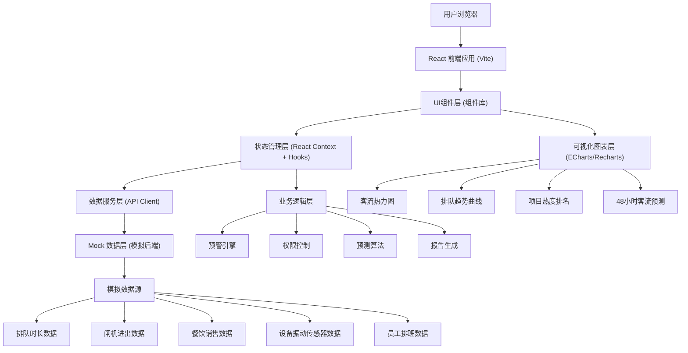
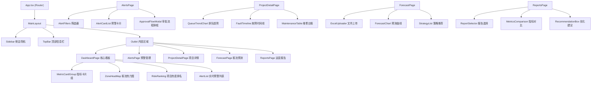
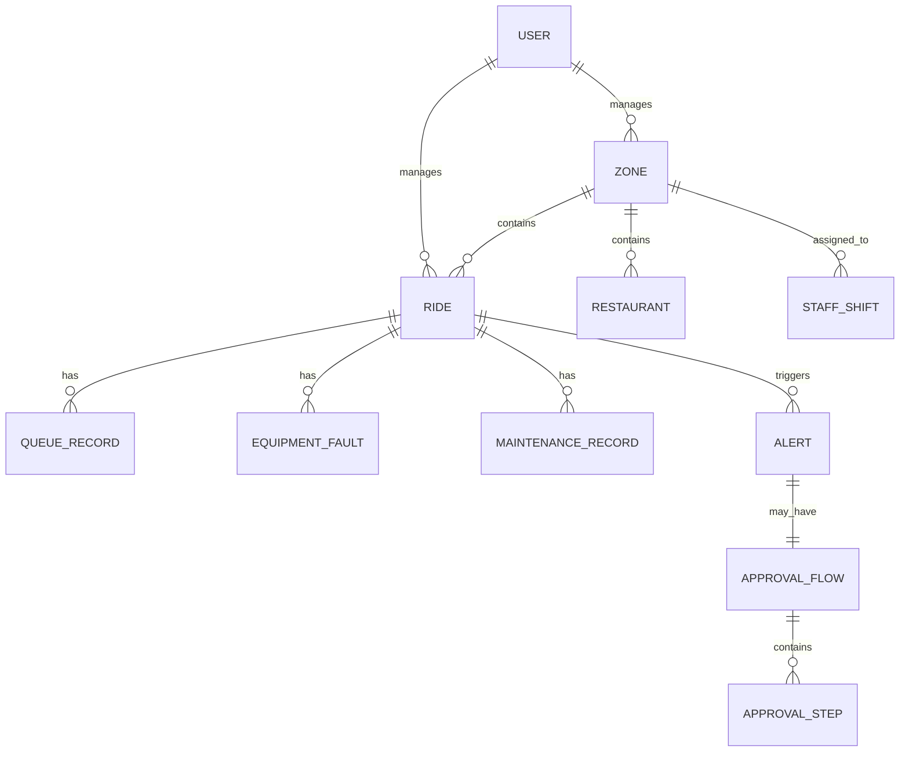

## 1. 架构设计



## 2. 技术描述

- 前端：React@18 + TypeScript@5 + Vite@5 + TailwindCSS@3
- 状态管理：React Context + useReducer（轻量级方案，避免过度工程化）
- 图表可视化：ECharts@5（专业图表库，支持热力图、时序图等丰富图表）+ Recharts（轻量级备用）
- UI组件：自定义组件库（TailwindCSS构建）+ lucide-react（图标）
- 路由：React Router@6
- 日期处理：dayjs
- 文件处理：xlsx（Excel解析）
- 后端：无后端，使用Mock数据模拟全部服务
- 数据持久化：localStorage（用户会话、报告缓存）

## 3. 路由定义

| 路由 | 用途 | 权限角色 |
|------|------|----------|
| /login | 登录页 | 公开 |
| /dashboard | 核心看板（首页） | 全部登录用户 |
| /alerts | 预警管理中心 | 运营主管及以上 |
| /project/:id | 项目下钻详情页 | 全部登录用户（按权限过滤） |
| /forecast | 客流预测与策略推荐 | 运营总监及以上 |
| /reports | 运营诊断报告 | 区域经理及以上 |

## 4. Mock 数据接口定义

```typescript
// 园区区域
interface Zone {
  id: string;
  name: string;
  visitorCount: number;
  capacity: number;
  heatLevel: number; // 0-100
}

// 游乐项目
interface Ride {
  id: string;
  name: string;
  zoneId: string;
  currentWaitTime: number; // 分钟
  avgWaitTime: number;
  capacity: number;
  availability: number; // 0-100%
  satisfaction: number; // 0-5
  status: 'normal' | 'warning' | 'maintenance';
  vibrationLevel: number;
  vibrationThreshold: number;
}

// 预警
interface Alert {
  id: string;
  type: 'queue' | 'vibration';
  level: 1 | 2;
  rideId: string;
  rideName: string;
  zoneId: string;
  message: string;
  createdAt: string;
  escalatedAt?: string;
  resolvedAt?: string;
  status: 'active' | 'processing' | 'resolved' | 'escalated';
  approvalFlow?: ApprovalFlow;
}

// 审批流程
interface ApprovalFlow {
  id: string;
  alertId: string;
  steps: ApprovalStep[];
  currentStep: number;
  actionType: 'restrict_flow' | 'fast_pass';
}

interface ApprovalStep {
  role: string;
  userId?: string;
  userName?: string;
  status: 'pending' | 'approved' | 'rejected';
  comment?: string;
  approvedAt?: string;
}

// 排队记录
interface QueueRecord {
  timestamp: string;
  waitTime: number;
  rideId: string;
}

// 设备故障
interface EquipmentFault {
  id: string;
  rideId: string;
  type: string;
  description: string;
  occurredAt: string;
  resolvedAt?: string;
  severity: 'low' | 'medium' | 'high';
}

// 维修记录
interface MaintenanceRecord {
  id: string;
  rideId: string;
  type: string;
  description: string;
  technician: string;
  startedAt: string;
  completedAt: string;
  partsReplaced: string[];
  cost: number;
}

// 餐饮数据
interface RestaurantData {
  id: string;
  name: string;
  zoneId: string;
  turnoverRate: number;
  todaySales: number;
  avgWaitTime: number;
}

// 员工排班
interface StaffShift {
  id: string;
  name: string;
  role: string;
  zoneId: string;
  shift: 'morning' | 'afternoon' | 'evening';
  startTime: string;
  endTime: string;
}

// 客流预测
interface ForecastData {
  timestamp: string;
  predictedVisitors: number;
  lowerBound: number;
  upperBound: number;
  historicalVisitors?: number;
}

// 运营策略推荐
interface StrategyRecommendation {
  id: string;
  type: 'extend_hours' | 'add_shows' | 'open_fast_pass' | 'add_staff';
  title: string;
  description: string;
  expectedImpact: string;
  confidence: number; // 0-100
  priority: 'high' | 'medium' | 'low';
}

// 周度运营报告
interface WeeklyReport {
  id: string;
  weekStart: string;
  weekEnd: string;
  metrics: {
    equipmentFaultRate: { current: number; lastWeek: number; lastYear: number };
    visitorComplaintRate: { current: number; lastWeek: number; lastYear: number };
    rideTurnoverRate: { current: number; lastWeek: number; lastYear: number };
  };
  recommendations: string[];
  generatedAt: string;
}

// 用户
interface User {
  id: string;
  name: string;
  role: 'gm' | 'director' | 'zone_manager' | 'supervisor' | 'maintenance';
  roleName: string;
  zoneIds?: string[];
  rideIds?: string[];
}
```

## 5. 前端组件架构



## 6. 数据模型

### 6.1 数据模型关系图



### 6.2 模拟数据初始化

| 数据实体 | 模拟数量 | 说明 |
|----------|----------|------|
| Zone 区域 | 6 | 奇幻大道、冒险岛、童话镇、未来城、海洋王国、恐龙谷 |
| Ride 游乐项目 | 20+ | 每个区域3-4个项目 |
| Restaurant 餐饮 | 12 | 每个区域2个餐厅 |
| Staff 员工 | 50+ | 各区域员工排班 |
| Alert 预警 | 5-10 | 模拟活跃预警，含1-2条二级预警 |
| QueueRecord 排队记录 | 每项目168条 | 近7天每小时一条 |
| EquipmentFault 故障 | 20条 | 模拟故障历史 |
| MaintenanceRecord 维修 | 30条 | 模拟维修记录 |
| WeeklyReport 报告 | 4份 | 近4周报告 |
